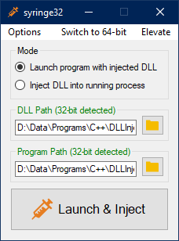

<p align="center">
  
</p>

# About <a href="https://en.wikipedia.org/wiki/C%2B%2B17"></a>
**syringe** is a DLL injector for Windows. It can work with both 32 and 64 bit DLLs and executables.

<p align="center">
  
</p>

- [Usage](#usage)
    - [Injecting from the command line](#injecting-from-the-command-line)
        - [Common usage scenarios](#common-usage-scenarios)
- [DLL compatibility](#dll-compatibility)
    - [Developing a syringe-compatible DLL](#developing-a-syringe-compatible-dll)
- [Building syringe](#building-syringe)
- [Disclaimer](#disclaimer)
- [License](#license)
    - [Assets](#assets)

# Usage

Simply run syringe. You can also drag a DLL file over `syringe.exe`

Modes:
- **Launch**: launch an executable and inject a DLL into it
- **PID**: inject a DLL into a running process by PID

Menu:
- **Elevate**: restart syringe with administrator privileges
- **Switch to 32/64-bit**: open the 32/64-bit version of syringe
- **Options**: set the command line for the program (for launch mode)

Process ID (PID mode):

- choose a running process or type an id (the first group of digits is considered as being the PID; if the first non-whitespace character isn't a digit, the id is invalid)
- use the `Refresh` button to update the list of running processes

## Injecting from the command line

```shell
syringe.exe [--no-gui] <DLL_Path> [--launch | -l | --pid | -p] <Program_Path_Or_PID> [args...]
```

`--no-gui` is optional (but must be the first arg); if it's specified and syringe encounters an error, no message box will be shown. In this case, use the syringe exit code
to find the error:

- **1**: invalid arguments
- **2**: too many arguments
- **3**: program path is invalid (doesn't exist or file is not a valid executable)
- **4**: architecture mismatch; you're trying to inject a 32-bit DLL into a 64-bit exe/process (or vice-versa), or you're trying to inject a 32-bit DLL with the 64-bit version of syringe (or vice-versa)
- **5**: invalid PID (not a valid int32, or no process with that id exists)
- **6**: access denied, try running syringe with administrator privileges
- **7**: not enough args, you're running syringe with `--no-gui` but you're only giving a few args (e.g. only the DLL path instead of DLL + program path)
- **8**: injection failed; run without `--no-gui` for more details

### Common usage scenarios

For most of these examples you can also specify `--no-gui` but it was omitted for simplicity.

Launch exe and inject DLL into it:

```shell
syringe.exe <DLL_Path> <Program_Path> [program_args...]
or
syringe.exe <DLL_Path> --launch <Program_Path> [program_args...]
or
syringe.exe <DLL_Path> -l <Program_Path> [program_args...]
or

```

Inject DLL into running process:

```shell
syringe.exe <DLL_Path> <PID>
or
syringe.exe <DLL_Path> --pid <PID>
or
syringe.exe <DLL_Path> -p <PID>
```

> Note that if you don't specify `-p` or `--pid`, and a file named `<PID>` (i.e. digits), syringe will run in launch mode with that file.

Open the syringe window with the DLL path pre-written in the text box:

```shell
syringe.exe <DLL_Path>
```

> You can't use `--no-gui` here; you have to pass all of the required arguments (dll path + program path or PID) because syringe won't spawn a GUI (and therefore can't get further input from you).

# DLL compatibility
The DLL, target exe/process, and syringe architectures must match (i.e. all 64-bit or all 32-bit).

If this constraint is satisfied, syringe should work with any DLLs (unless, of course, the DLL is faulty and crashes `in DllMain`).

## The Init function

If the DLL exports a function with this signature:
```cpp
DWORD Init(void* context)
```
...it will be called by syringe after the DLL was loaded (`Init(NULL)`). The context pointer is always `NULL`, and is part of the
signature purely because syringe executes the function on another thread. The signature of the thread function takes a context pointer.

`Init` should return `0` on success.

Note that if this function doesn't exist, syringe will only load the DLL; `DllMain` will be called and nothing more.

## Developing a syringe-compatible DLL

If you develop a DLL, you can use this `Init` function to initialize everything (or to do anything). Try to avoid placing code in `DllMain`.

An example of properly-defined `Init` function:

```cpp
extern "C" __declspec(dllexport) DWORD WINAPI Init(void* context) {
    // Since functions marked __stdcall are decorated only when compiling for 32-bit, make sure to export
    // the function as `Init` even in that case
#ifndef _WIN64
#    pragma comment(linker, "/EXPORT:" __FUNCTION__ "=" __FUNCDNAME__)
#endif

    // Do anything here. Remember: context is NULL, so don't try to use it.
    // ...

    // Signal syringe that everything went OK
    return 0;
}
```

# Building syringe

This project uses C++/CLI (v143) and VS 2022. Make sure to have them installed, as it's not guaranteed to work with anything else.

Building should be straightforward, since syringe was made for developers. If you don't know how to build it, you don't need it.

# Disclaimer

syringe was made for debugging and testing purposes, and should **not** be used for malicious purposes. It doesn't use fancy
injection methods (like reflective PE injection) on purpose, so it can easily be detected.

I cannot be held responsible for any type of misuses and/or damages done by this software, nor for your own actions. Use this software at **your own risk and responsibility**.

**This is a tool for developers.**

# License<a href="https://github.com/UnexomWid/syringe/blob/master/LICENSE"></a>

syringe was developed by [UnexomWid](https://github.com/UnexomWid). It is licensed under the [MIT license](https://github.com/UnexomWid/syringe/blob/master/LICENSE)

## Assets

This project makes use of the following icons from [icons8](https://icons8.com):

- [Syringe icon](https://icons8.com/icon/uR76IG2xWAIk/syringe)
- [Folder icon](https://icons8.com/icon/H6BJs8h4en6g/folder)
- [Refresh icon](https://icons8.com/icon/ziqQwaOQPb2C/refresh)